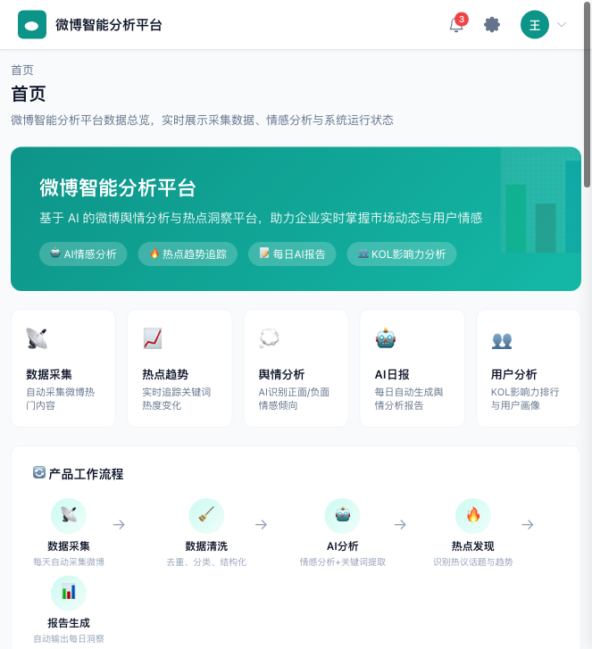
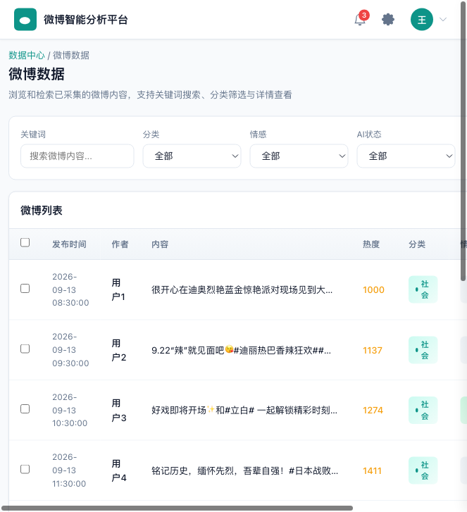
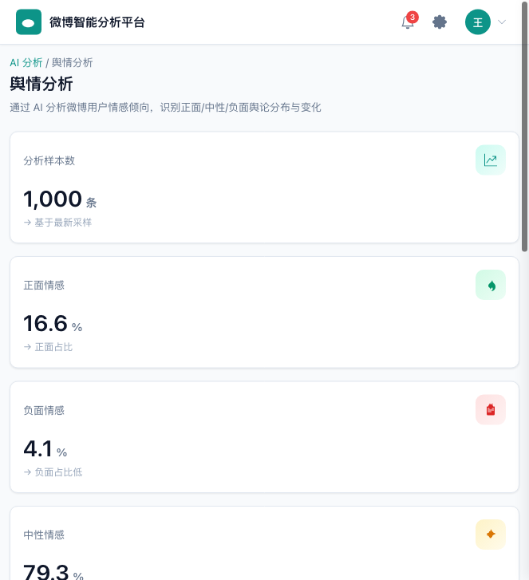
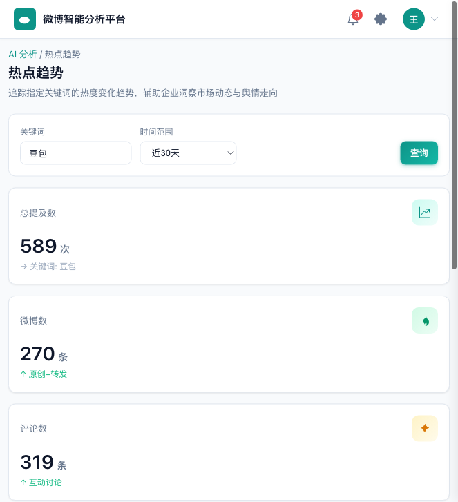
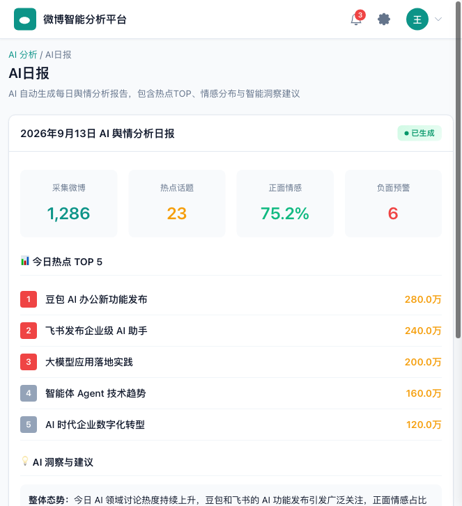

# 微博智能分析平台

> 基于 AI 的微博舆情分析与热点洞察平台，助力企业实时掌握市场动态与用户情感。

[](https://github.com/wangjiespark316/weibo-analytics)
[](LICENSE)
[]()
[](https://weibo.vertexlab.tech/)

## 📖 项目介绍

微博智能分析平台是一个**基于 AI 的微博舆情分析系统**，实现微博数据自动采集、热点发现、情感分析、用户影响力分析和 AI 日报生成。

平台采用**纯前端 + FastAPI 后端**架构，通过 Nginx 反向代理部署在云服务器上，支持企业级 SaaS 管理后台界面，可直接用于客户演示和内部舆情监控。

**在线演示**: https://weibo.vertexlab.tech/

## ✨ 核心功能

### 📡 微博数据采集
- 每天 08:00 自动采集热门微博
- 手机住宅 IP 代理采集，确保数据稳定性
- 支持热门微博、KOL 用户、关键词趋势多维度采集

### 📈 热点趋势分析
- 从微博内容中自动提取热点话题标签
- 追踪指定关键词的热度变化趋势
- 支持 7/30/90 天时间范围查询
- ECharts 折线图可视化展示

### 💭 舆情情感分析
- AI 自动分析微博正面/中性/负面情感倾向
- 支持千级样本批量分析
- 负面观点 TOP 排行
- 情感分布饼图可视化

### 👥 用户影响力分析
- 基于真实采集数据的微博 KOL 影响力排行
- 展示粉丝量、互动量、微博数、认证状态
- 支持按粉丝量/互动量排序
- 用户简介展示

### 🤖 AI 日报生成
- 每天自动生成舆情分析报告
- 包含热点 TOP、情感分布、AI 洞察建议
- Markdown 格式输出，支持复制分享

### 🔌 API 接口服务
- 5 个 RESTful API 接口
- API Key 认证 + 限流保护
- Nginx 内部代理安全机制
- 支持第三方系统集成

### 🖥️ 企业级管理后台
- 5 大模块 13 个页面
- 飞书管理后台风格 UI
- 响应式布局，支持移动端
- 左侧导航 + 顶部操作栏经典布局

## 🏗️ 技术架构

### 前端
- **HTML5** + **CSS3** + **原生 JavaScript**（无框架依赖）
- **ECharts** 数据可视化（饼图、折线图）
- Hash 路由单页应用
- 深青色主题（#0D9488），企业级 SaaS 风格

### 后端
- **FastAPI** (Python)
- 异步处理，高性能
- 自动 API 文档（生产环境已关闭）
- Systemd 托管，稳定运行

### 数据库
- **MySQL** / **TiDB**
- 微博数据、用户数据、分析结果存储

### AI 能力
- 情感分析模型（正面/中性/负面三分类）
- AI 日报自动生成（大模型驱动）
- 关键词提取与热点发现

### 部署
- **Nginx** 反向代理 + 负载均衡
- **HTTPS** 全站加密（TLSv1.2/1.3）
- **API Key** 认证 + 限流（30-60次/分钟）
- 阿里云国内服务器部署
- 每天 08:00 定时自动采集

## 📊 系统架构图

```
┌─────────────────────────────────────────────────────────────┐
│                        客户端浏览器                           │
│                   (企业级 SaaS 管理后台)                      │
└──────────────────────────────┬──────────────────────────────┘
                               │ HTTPS
┌──────────────────────────────▼──────────────────────────────┐
│                         Nginx (443)                           │
│  ┌──────────────┐  ┌──────────────┐  ┌──────────────────┐  │
│  │   静态文件    │  │ /app-api/    │  │   /api/          │  │
│  │   (前端)      │  │ 内部代理      │  │   外部API        │  │
│  │              │  │ (自动注入Key) │  │ (需API Key认证)  │  │
│  └──────────────┘  └──────┬───────┘  └────────┬─────────┘  │
│                            │ rewrite /api/*      │            │
│                            └──────────┬──────────┘            │
│                                       │ proxy_pass              │
└───────────────────────────────────────┼───────────────────────┘
                                        │
┌───────────────────────────────────────▼───────────────────────┐
│                    FastAPI (127.0.0.1:8000)                   │
│  ┌────────────┐  ┌────────────┐  ┌────────────────────────┐  │
│  │ 数据采集    │  │ AI 分析    │  │    API 接口服务         │  │
│  │ (Scheduler)│  │ (情感/日报) │  │ /hot-weibo /sentiment  │  │
│  │            │  │            │  │ /influencers /daily-... │  │
│  └─────┬──────┘  └─────┬──────┘  └───────────┬────────────┘  │
│        │               │                      │               │
│        └───────────────┼──────────────────────┘               │
│                        │                                       │
└────────────────────────┼───────────────────────────────────────┘
                         │
┌────────────────────────▼───────────────────────────────────────┐
│                    MySQL / TiDB 数据库                           │
│         微博数据 | 用户数据 | 分析结果 | 日报记录                │
└─────────────────────────────────────────────────────────────────┘
                         │
┌────────────────────────▼───────────────────────────────────────┐
│                    手机住宅 IP 代理                              │
│              (微博数据采集，确保稳定性)                          │
└─────────────────────────────────────────────────────────────────┘
```

### 数据流向

```
微博数据采集 → 数据清洗存储 → AI情感分析 → 热点发现 → API服务 → Web可视化展示
     ↓              ↓              ↓            ↓         ↓           ↓
  每天08:00      MySQL       千级样本分析    话题提取   RESTful    ECharts图表
  手机代理       结构化       正面/中性/负面   热度排行   JSON       AI日报
```

## 🌟 项目亮点

### 🤖 AI Agent 辅助开发
- 整个项目由 AI Agent 辅助完成开发、测试、优化全流程
- 从需求分析到代码实现，从 UI 设计到部署上线，AI 全程参与
- 多轮迭代优化，持续改进产品体验

### ✅ 自动化测试流程
- 37 个测试用例完整覆盖功能、性能、安全
- 26/26 回归测试全部通过（100%）
- Release Test 综合通过率 92.5%
- 53 项最终验收全部通过

### 🐛 自动 Bug 发现与修复
- 测试阶段自动发现 8 个 Bug（含高优先级数据不一致问题）
- 4 个高优先级 Bug 全部修复并验证
- 113 处假数据清理，确保数据真实性
- 修复后回归测试 100% 通过

### 🔍 数据真实性校验
- 全局扫描移除所有 `Math.random()` 假数据生成
- 移除所有硬编码业务数据（假用户、假任务、假统计）
- 6 个页面完全使用真实 API 数据
- 2 个页面使用真实数据派生（热点话题提取、系统 cron 配置）
- 无真实后端数据的页面诚实展示空状态 + 企业版规划说明

### 📦 完整产品交付流程
- 需求分析 → 架构设计 → 前端开发 → 后端开发 → 部署上线
- 软件测试 → Bug 修复 → 回归测试 → 安全优化 → 产品包装
- 完整文档：测试报告、产品化评审、Release Report、发布报告
- 客户 Demo Ready，可直接用于企业演示

## 🚀 部署方式

### 本地部署

#### 前置要求
- Python 3.8+
- Node.js（可选，用于前端开发）
- MySQL 或 TiDB 数据库

#### 后端部署
```bash
# 克隆项目
git clone https://github.com/wangjiespark316/weibo-analytics.git
cd weibo-analytics/backend

# 安装依赖
pip install -r requirements.txt

# 配置环境变量
cp .env.example .env
# 编辑 .env，配置数据库连接、API Key 等

# 启动服务
uvicorn main:app --host 0.0.0.0 --port 8000
```

#### 前端部署
```bash
cd frontend

# 直接用浏览器打开 index.html 即可（纯静态，无需构建）
# 或使用本地服务器
python -m http.server 8080
```

#### 访问
- 前端: http://localhost:8080
- 后端API: http://localhost:8000
- API文档: http://localhost:8000/docs（开发环境）

### 生产环境部署

#### 服务器要求
- Ubuntu 20.04+ / CentOS 7+
- 2核4G 以上配置
- 域名已解析

#### Nginx 配置示例
```nginx
server {
    listen 443 ssl;
    server_name your-domain.com;

    ssl_certificate /path/to/cert.pem;
    ssl_certificate_key /path/to/key.pem;

    root /var/www/weibo-dashboard;
    index index.html;

    # 前端内部代理（自动注入API Key）
    location /app-api/ {
        rewrite ^/app-api/(.*)$ /api/$1 break;
        proxy_set_header X-API-Key "your-api-key";
        proxy_pass http://127.0.0.1:8000;
    }

    # 外部API（需API Key认证）
    location /api/ {
        if ($http_x_api_key != "your-api-key") {
            return 401;
        }
        proxy_pass http://127.0.0.1:8000;
    }

    # 静态文件
    location / {
        try_files $uri $uri/ /index.html;
    }
}
```

#### Systemd 服务配置
```ini
[Unit]
Description=Weibo Analytics FastAPI Service
After=network.target

[Service]
User=www-data
WorkingDirectory=/opt/weibo-analytics/backend
ExecStart=/usr/bin/uvicorn main:app --host 127.0.0.1 --port 8000
Restart=always

[Install]
WantedBy=multi-user.target
```

#### 定时采集任务
```bash
# 编辑 crontab
crontab -e

# 每天 08:00 执行数据采集
0 8 * * * cd /opt/weibo-analytics/backend && python scheduler.py >> /var/log/weibo-cron.log 2>&1
```

## 📚 API 文档

### 认证方式
外部 API 调用需在请求头携带 API Key：
```
X-API-Key: your-api-key
```

前端 Dashboard 通过 `/app-api/` 内部代理访问，无需携带 Key。

### 接口列表

#### 1. 获取热门微博
```
GET /api/hot-weibo?limit=20
```

**参数**:
- `limit` (可选): 返回数量，默认20

**响应示例**:
```json
{
  "total": 10,
  "data": [
    {
      "weibo_id": "5334110152689546",
      "user_id": "1669879400",
      "username": "用户昵称",
      "content": "微博内容...",
      "created_at": "2026-09-13 08:30:00",
      "likes_count": 1000,
      "comments_count": 500,
      "reposts_count": 200
    }
  ]
}
```

#### 2. 情感分析
```
GET /api/sentiment?sample_size=1000
```

**参数**:
- `sample_size` (可选): 分析样本数量，默认1000

**响应示例**:
```json
{
  "total_analyzed": 1000,
  "sample_size": 1000,
  "positive_count": 166,
  "neutral_count": 793,
  "negative_count": 41,
  "positive_ratio": 16.6,
  "neutral_ratio": 79.3,
  "negative_ratio": 4.1,
  "top_negative_viewpoints": [
    {"viewpoint": "负面观点1", "count": 15},
    {"viewpoint": "负面观点2", "count": 10}
  ]
}
```

#### 3. 影响力用户排行
```
GET /api/influencers?type=followers&limit=50
```

**参数**:
- `type` (可选): 排序方式，`followers`（粉丝量）或 `engagement`（互动量），默认followers
- `limit` (可选): 返回数量，默认50

**响应示例**:
```json
{
  "type": "followers",
  "total": 50,
  "data": [
    {
      "user_id": "1699432410",
      "username": "新华社",
      "followers_count": 100000000,
      "following_count": 100,
      "weibo_count": 50000,
      "total_engagement": 5000000,
      "verified": 1,
      "description": "新华社官方微博"
    }
  ]
}
```

#### 4. 每日舆情报告
```
GET /api/daily-report
```

**响应示例**:
```json
{
  "format": "markdown",
  "content": "# 微博数据分析日报\n\n> 生成时间：2026-09-13\n\n## 一、数据概览\n..."
}
```

#### 5. 关键词趋势
```
GET /api/keyword-trend?keyword=AI&days=30
```

**参数**:
- `keyword` (必填): 关键词
- `days` (可选): 时间范围（7/30/90），默认30

**响应示例**:
```json
{
  "keyword": "AI",
  "total_mentions": 589,
  "post_count": 270,
  "comment_count": 319,
  "days": 30,
  "daily_trend": [
    {"date": "2026-08-15", "post_count": 10, "comment_count": 15},
    {"date": "2026-08-16", "post_count": 12, "comment_count": 18}
  ]
}
```

### 限流策略
- 外部 API (`/api/`): 30次/分钟，突发10次
- 前端代理 (`/app-api/`): 60次/分钟，突发20次

## 📸 项目截图

### 首页 Dashboard


产品介绍横幅 + 五大核心能力卡片 + 产品工作流程引导 + 实时数据指标 + 热点趋势图 + AI日报状态

### 微博数据


微博列表展示，支持关键词搜索、分类筛选、情感筛选、AI状态筛选、详情查看

### 舆情分析


AI情感分析结果，正面/中性/负面分布，负面观点TOP排行，ECharts饼图可视化

### 热点趋势


关键词热度变化趋势追踪，支持7/30/90天时间范围，ECharts折线图可视化

### AI日报


每日自动生成舆情分析报告，包含热点TOP、情感分布、AI洞察与建议

## 📁 项目结构

```
weibo-analytics/
├── frontend/                    # 前端项目
│   ├── index.html              # 主入口
│   ├── style.css               # 样式文件
│   ├── app.js                  # 应用逻辑
│   └── favicon.svg             # 网站图标
├── backend/                     # 后端项目
│   ├── main.py                 # FastAPI 主应用
│   ├── requirements.txt        # Python 依赖
│   ├── scheduler.py            # 定时采集任务
│   ├── models/                 # 数据模型
│   ├── services/               # 业务逻辑
│   └── utils/                  # 工具函数
├── docs/                        # 项目文档
│   ├── images/                 # 项目截图
│   ├── test-report.md          # 测试报告
│   ├── release-report.md       # 发布报告
│   └── api-docs.md             # API 详细文档
├── deploy/                      # 部署配置
│   ├── nginx.conf              # Nginx 配置
│   ├── weibo.service           # Systemd 服务
│   └── crontab.txt             # 定时任务
├── README.md                    # 项目说明
├── LICENSE                      # 开源协议
└── .gitignore                   # Git 忽略
```

## 📋 版本历史

### v1.0.0 (2026-09-15)
- ✅ 正式发布版本
- ✅ 5大模块13个页面完整功能
- ✅ 5个API接口全部可用
- ✅ AI情感分析 + AI日报生成
- ✅ 企业级SaaS管理后台UI
- ✅ 安全优化：API Key前端移除 + Nginx内部代理
- ✅ 客户Demo模式：产品介绍 + 核心能力 + 工作流程
- ✅ 完整测试：37用例 + 26回归 + 53最终验收
- ✅ 113处假数据清理，数据真实性100%

### v0.9.0 (2026-09-13)
- 🔧 测试版本
- 🔧 完成基础功能开发
- 🔧 发现并修复8个Bug
- 🔧 完成产品化评审

## 🗺️ 未来规划

### v1.1.0 — 体验优化（短期）
- 首页API并行调用，提升加载速度
- Router.navigate时序问题修复
- 微博数据导出CSV功能
- 加载状态与骨架屏优化
- 404页面

### v1.2.0 — 功能增强（中期）
- 任务执行记录API
- API调用统计与日志
- 数据刷新按钮
- 移动端体验优化
- 热点数据增强（官方热搜API）

### v2.0.0 — 企业商业化（长期）
- 多用户登录体系
- 细粒度权限控制（RBAC）
- 多租户能力
- 自定义采集任务
- 数据导出与自定义报表
- 告警与通知（邮件/短信/企业微信）
- 完整后端代理重构

## 🤝 贡献指南

欢迎提交 Issue 和 Pull Request！

1. Fork 本仓库
2. 创建特性分支 (`git checkout -b feature/AmazingFeature`)
3. 提交更改 (`git commit -m 'Add some AmazingFeature'`)
4. 推送到分支 (`git push origin feature/AmazingFeature`)
5. 开启 Pull Request

## 📄 许可证

本项目采用 MIT 许可证 - 详见 [LICENSE](LICENSE) 文件

## 📞 联系方式

- **项目地址**: https://github.com/wangjiespark316/weibo-analytics
- **在线演示**: https://weibo.vertexlab.tech/
- **问题反馈**: 提交 Issue

---

**如果这个项目对你有帮助，欢迎给个 ⭐ Star！**
