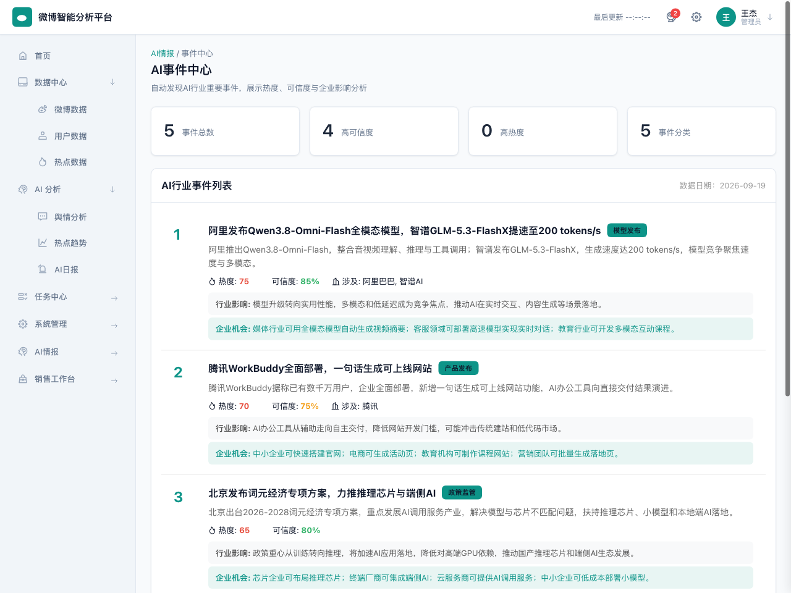
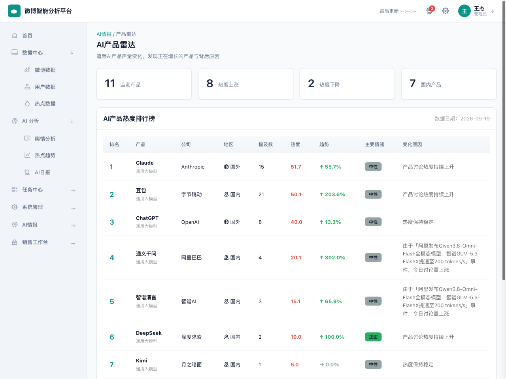
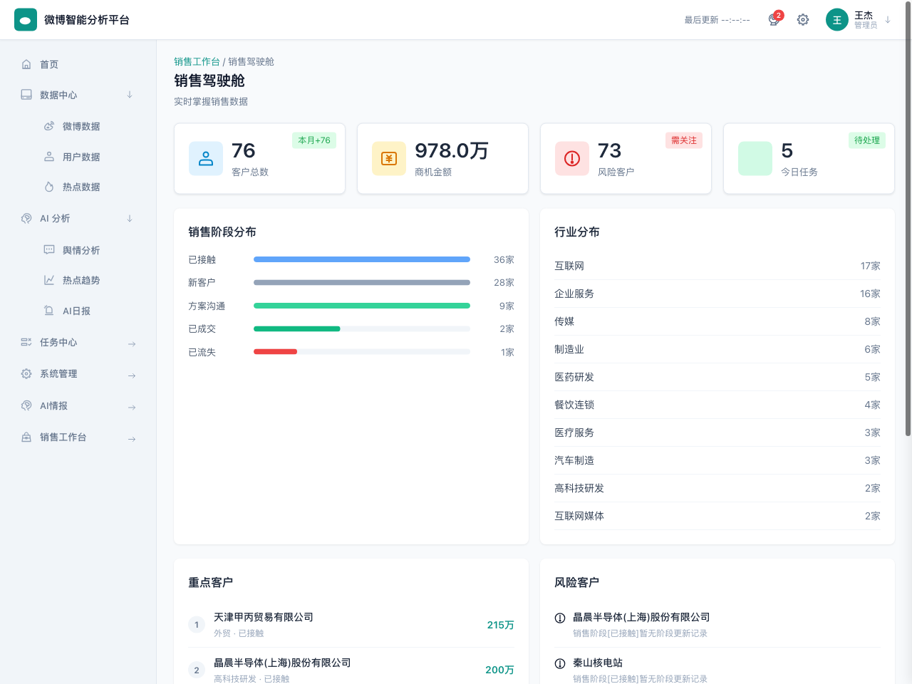
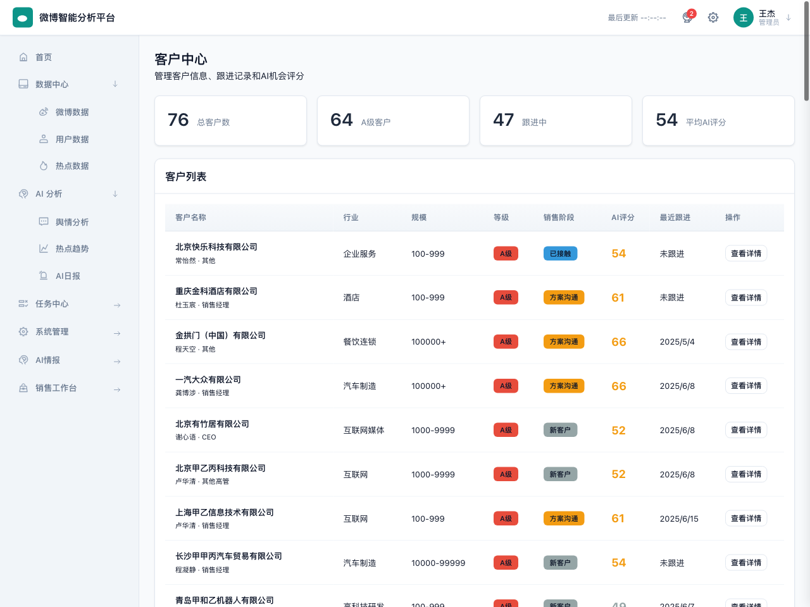

# 微博智能分析平台

> 基于 AI 的微博舆情分析与热点洞察平台，助力企业实时掌握市场动态与用户情感。

[](https://github.com/wangjiespark316/weibo-analytics)
[](LICENSE)
[](https://www.python.org/)
[](https://fastapi.tiangolo.com/)
[]()
[](https://weibo.vertexlab.tech/)
[](https://github.com/wangjiespark316/weibo-analytics/releases)

## 📖 项目介绍

微博智能分析平台是一个**基于 AI 的微博舆情分析系统**，实现微博数据自动采集、热点发现、情感分析、用户影响力分析和 AI 日报生成。

在此基础上，平台已进一步升级为 **AI 行业情报与销售智能系统**：不再只监控固定关键词，而是通过 LLM 自动聚类「AI 热点事件」、追踪「AI 产品声量」、雷达扫描「技术趋势」，每日自动产出《AI 行业日报》，并延伸出面向销售团队的客户画像、成交概率预测、销售漏斗与飞书主动推送。

平台采用**纯前端 + FastAPI 后端**架构，通过 Nginx 反向代理部署在云服务器上，支持企业级 SaaS 管理后台界面，可直接用于客户演示和内部舆情监控。

**在线演示**: https://weibo.vertexlab.tech/

## 🗂️ 仓库结构

本仓库包含「对外公开站 + 内部管理台 + 后端服务」三部分，三者共用同一套后端与数据，相辅相成：

| 目录 | 说明 | 对应访问 |
|------|------|----------|
| `backend/` | FastAPI 后端：微博采集、情感/热点分析、API 与定时调度 | 内部接口 |
| `frontend/` | 内部管理台（完整功能：数据采集、AI 情报、销售驾驶舱、用户与通知） | 内部使用 |
| `public/` | 对外公开站（精简只读：今日热帖、讨论趋势、情感占比，含移动端适配与 ICP 备案号） | https://weibo.vertexlab.tech |

- **公开站 `public/`**：面向外部访客的轻量页面，文件小、加载快，只读展示每日舆情；部署到服务器 `/var/www/weibo-public`，由 Nginx 作为站点根（页面以绝对路径 `/` 引用资源）。
- **管理台 `frontend/`**：功能完整的内部平台，供运营 / 销售团队使用。
- 两者数据均来自 `backend/`，公开站可理解为管理台能力对外的「精简窗口」。

> 服务器地址、账号、Token、密钥等均不在本仓库记录，请通过安全渠道单独管理。

## 🎬 Demo 展示

### 在线体验
👉 **立即体验**: [https://weibo.vertexlab.tech/](https://weibo.vertexlab.tech/)

### 产品演示视频
> 🎥 Demo 视频制作中，敬请期待。
>
> 视频将展示：首页数据概览 → 微博数据采集 → 热点趋势分析 → 舆情情感分析 → AI 日报生成的完整流程。

### 快速预览
| 模块 | 功能 | 截图 |
|------|------|------|
| Dashboard | 数据概览 + 核心能力 + 工作流程 | [查看](#-项目截图) |
| 微博数据 | 搜索筛选 + 表格展示 + 详情查看 | [查看](#-项目截图) |
| 舆情分析 | 情感分布 + 负面观点 + AI 洞察 | [查看](#-项目截图) |
| 热点趋势 | 关键词追踪 + 趋势图表 + 统计数据 | [查看](#-项目截图) |
| AI 日报 | 自动生成 + 热点 TOP + 复制分享 | [查看](#-项目截图) |
| AI 事件中心（v1.1） | 事件聚类 + 热度/可信度 + 企业机会 | [查看](docs/images/events.png) |
| AI 产品雷达（v1.1） | 产品声量排行 + 增长率 + 事件归因 | [查看](docs/images/products.png) |
| 销售驾驶舱（v1.1） | 商机金额 + 阶段/行业分布 + 风险客户 | [查看](docs/images/sales-dashboard.png) |
| 客户中心（v1.1） | 客户列表 + AI 评分 + 真实跟进 | [查看](docs/images/customers.png) |

## ✨ 核心功能

### 📡 微博数据采集
- 每日多时段增量采集（09:00 / 13:00 / 18:00 / 22:00），次日 08:30 补采前一天全天并统一分析
- 代理采集降低限流风险，保证数据稳定性
- 实时搜索 + 时间窗 + AI 相关性过滤，聚焦 AI 行业内容；历史娱乐数据归档隔离，不混入行业分析
- 支持热门微博、KOL 用户、关键词趋势多维度采集

### 📈 热点趋势分析
- 从微博内容中自动提取热点话题标签
- 追踪指定关键词的热度变化趋势
- 支持 7/30/90 天时间范围查询
- ECharts 折线图可视化展示

### 💭 舆情情感分析
- AI 自动分析微博正面/中性/负面情感倾向
- 支持千级样本批量分析
- 负面观点 TOP 排行
- 情感分布饼图可视化

### 👥 用户影响力分析
- 基于真实采集数据的微博 KOL 影响力排行
- 展示粉丝量、互动量、微博数、认证状态
- 支持按粉丝量/互动量排序
- 用户简介展示

### 🤖 AI 日报生成
- 每天自动生成舆情分析报告
- 包含热点 TOP、情感分布、AI 洞察建议
- Markdown 格式输出，支持复制分享

### 🛰️ AI 行业情报三层模型（v1.1）
- **AI 热点事件自动发现**：LLM 对当日 AI 相关微博聚类，抽取事件标题/摘要/涉及公司与技术，输出热度评分与**可信度评分**、行业影响与**企业应用机会**，分类固定枚举（模型发布/产品发布/公司动态/融资/政策/技术突破/企业案例/行业趋势）
- **AI 产品声量雷达**：内置国内外 AI 产品库（豆包/DeepSeek/通义/Kimi/文心/元宝/智谱、ChatGPT/Claude/Gemini/Copilot/Perplexity），统计提及量、互动热度、增长率并自动关联事件，回答"谁在涨、为什么涨"
- **AI 技术趋势雷达**：近 7 天 vs 近 30 天对比，识别 Agent、多模态、AI 编程、具身智能等方向的升温/稳定/下降，并给出企业落地机会
- **AI 行业日报**：流水线每日自动整合事件/产品/趋势，LLM 生成三大事件、趋势变化、企业应用建议与今日总结
- **自动化流水线**：采集→事件→产品→趋势→日报，运行锁防并发、分步重试、健康检查、日报质量评分，**默认分析"前一天全天"完整数据**

### 💼 AI 销售情报助手（v1.1）
- 行业机会识别 + 客户匹配，把 AI 趋势映射到制造业/互联网/教育/医疗等行业的可落地场景
- 客户 AI 画像、跟进记录 AI 总结、AI 机会评分、成交概率预测与推进策略
- 销售漏斗分析（各阶段客户数/金额/转化率）、今日重点客户与销售话术生成
- **已真实接入飞书多维表 CRM**：客户、跟进记录、商机三张表每日 07:45 自动同步入库，并重算 AI 评分、成交预测与销售漏斗
- 飞书机器人销售晨报、客户超期跟进提醒（Webhook 未配置时自动降级，不影响主流程）

### 🔌 API 接口服务
- 覆盖基础数据、AI 行业情报、销售智能、流水线管理的 RESTful API
- API Key 认证 + 限流保护
- Nginx 内部代理安全机制
- 支持第三方系统集成

### 🖥️ 企业级管理后台
- 7 大功能区、26 个页面（22 个侧边导航页 + 客户详情、销售预测/漏斗/复盘等二级页）
- 飞书管理后台风格 UI
- 响应式布局，支持移动端
- 左侧导航 + 顶部操作栏经典布局

## 🏗️ 技术架构

### 前端
- **HTML5** + **CSS3** + **原生 JavaScript**（无框架依赖）
- **ECharts** 数据可视化（饼图、折线图）
- Hash 路由单页应用
- 深青色主题（#0D9488），企业级 SaaS 风格

### 后端
- **FastAPI** (Python)
- 异步处理，高性能
- 自动 API 文档（生产环境已关闭）
- Systemd 托管，稳定运行

### 数据库
- **MySQL** / **TiDB**
- 微博数据、用户数据、分析结果存储

### AI 能力
- 情感分析模型（正面/中性/负面三分类）
- AI 日报自动生成（大模型驱动）
- 关键词提取与热点发现

### 部署
- **Nginx** 反向代理 + 负载均衡
- **HTTPS** 全站加密（TLSv1.2/1.3）
- **API Key** 认证 + 限流（30-60次/分钟）
- 阿里云国内服务器部署（Nginx + Uvicorn + Systemd）
- 定时任务：07:45 飞书 CRM 同步；08:30 补采前一天全天并运行 AI 情报流水线；日内 09:00/13:00/18:00/22:00 四次增量采集

## 📊 系统架构图

```
┌─────────────────────────────────────────────────────────────┐
│                        客户端浏览器                           │
│                   (企业级 SaaS 管理后台)                      │
└──────────────────────────────┬──────────────────────────────┘
                               │ HTTPS
┌──────────────────────────────▼──────────────────────────────┐
│                         Nginx (443)                           │
│  ┌──────────────┐  ┌──────────────┐  ┌──────────────────┐  │
│  │   静态文件    │  │ /app-api/    │  │   /api/          │  │
│  │   (前端)      │  │ 内部代理      │  │   外部API        │  │
│  │              │  │ (自动注入Key) │  │ (需API Key认证)  │  │
│  └──────────────┘  └──────┬───────┘  └────────┬─────────┘  │
│                            │ rewrite /api/*      │            │
│                            └──────────┬──────────┘            │
│                                       │ proxy_pass              │
└───────────────────────────────────────┼───────────────────────┘
                                        │
┌───────────────────────────────────────▼───────────────────────┐
│                    FastAPI (127.0.0.1:8000)                   │
│  ┌────────────┐  ┌────────────┐  ┌────────────────────────┐  │
│  │ 数据采集    │  │ AI 分析    │  │    API 接口服务         │  │
│  │ (Scheduler)│  │ (情感/日报) │  │ /hot-weibo /sentiment  │  │
│  │            │  │            │  │ /influencers /daily-... │  │
│  └─────┬──────┘  └─────┬──────┘  └───────────┬────────────┘  │
│        │               │                      │               │
│        └───────────────┼──────────────────────┘               │
│                        │                                       │
└────────────────────────┼───────────────────────────────────────┘
                         │
┌────────────────────────▼───────────────────────────────────────┐
│                    MySQL / TiDB 数据库                           │
│         微博数据 | 用户数据 | 分析结果 | 日报记录                │
└─────────────────────────────────────────────────────────────────┘
                         │
┌────────────────────────▼───────────────────────────────────────┐
│                    代理采集（防限流）                            │
│        定时增量采集 + 实时搜索 + 时间窗 + AI 相关性过滤          │
└─────────────────────────────────────────────────────────────────┘
```

### 数据流向

```
微博数据采集 → 数据清洗存储 → AI情感分析 → 热点发现 → API服务 → Web可视化展示
     ↓              ↓              ↓            ↓         ↓           ↓
  定时增量采集    MySQL       千级样本分析    话题提取   RESTful    ECharts图表
  代理防限流      结构化       正面/中性/负面   热度排行   JSON       AI日报
```

## 🌟 项目亮点

### 🤖 AI Agent 辅助开发
- 整个项目由 AI Agent 辅助完成开发、测试、优化全流程
- 从需求分析到代码实现，从 UI 设计到部署上线，AI 全程参与
- 多轮迭代优化，持续改进产品体验

### ✅ 自动化测试流程
> 以下为 v1.0 发布阶段基线；v1.1 当前验证见文末「测试与质量保障」。
- 37 个测试用例完整覆盖功能、性能、安全
- 26/26 回归测试全部通过（100%）
- Release Test 综合通过率 92.5%
- 53 项最终验收全部通过

### 🐛 自动 Bug 发现与修复
- 测试阶段自动发现 8 个 Bug（含高优先级数据不一致问题）
- 4 个高优先级 Bug 全部修复并验证
- 113 处假数据清理，确保数据真实性
- 修复后回归测试 100% 通过

### 🔍 数据真实性校验
- 全局扫描移除所有 `Math.random()` 假数据生成
- 移除所有硬编码业务数据（假用户、假任务、假统计）
- v1.1 全部 26 个页面只展示真实 API / 数据库数据，或由真实数据派生（热点话题提取、系统 cron 配置）
- 无真实后端数据的页面诚实展示空状态 + 企业版规划说明，绝不伪造

### 📦 完整产品交付流程
- 需求分析 → 架构设计 → 前端开发 → 后端开发 → 部署上线
- 软件测试 → Bug 修复 → 回归测试 → 安全优化 → 产品包装
- 完整文档：测试报告、产品化评审、Release Report、发布报告
- 客户 Demo Ready，可直接用于企业演示

## 🚀 部署方式

### 本地部署

#### 前置要求
- Python 3.8+
- Node.js（可选，用于前端开发）
- MySQL 或 TiDB 数据库

#### 后端部署
```bash
# 克隆项目
git clone https://github.com/wangjiespark316/weibo-analytics.git
cd weibo-analytics/backend

# 安装依赖
pip install -r requirements.txt

# 配置环境变量
cp .env.example .env
# 编辑 .env，配置 DATABASE_URL（TiDB/MySQL）与 LLM_API_KEY

# 启动服务（在 backend 目录下，模块名为 step7_api_service.main）
uvicorn step7_api_service.main:app --host 0.0.0.0 --port 8000
```

> 后端目录结构、环境变量与每日流水线详见 [backend/README.md](backend/README.md)。

#### 前端部署
```bash
cd frontend

# 直接用浏览器打开 index.html 即可（纯静态，无需构建）
# 或使用本地服务器
python -m http.server 8080
```

#### 访问
- 前端: http://localhost:8080
- 后端API: http://localhost:8000
- API文档: http://localhost:8000/docs（开发环境）

### 生产环境部署

#### 服务器要求
- Ubuntu 20.04+ / CentOS 7+
- 2核4G 以上配置
- 域名已解析

#### Nginx 配置示例
```nginx
server {
    listen 443 ssl;
    server_name your-domain.com;

    ssl_certificate /path/to/cert.pem;
    ssl_certificate_key /path/to/key.pem;

    root /var/www/weibo-dashboard;
    index index.html;

    # 前端内部代理（自动注入API Key）
    location /app-api/ {
        rewrite ^/app-api/(.*)$ /api/$1 break;
        proxy_set_header X-API-Key "your-api-key";
        proxy_pass http://127.0.0.1:8000;
    }

    # 外部API（需API Key认证）
    location /api/ {
        if ($http_x_api_key != "your-api-key") {
            return 401;
        }
        proxy_pass http://127.0.0.1:8000;
    }

    # 静态文件
    location / {
        try_files $uri $uri/ /index.html;
    }
}
```

#### Systemd 服务配置
```ini
[Unit]
Description=Weibo Analytics FastAPI Service
After=network.target

[Service]
User=www-data
WorkingDirectory=/opt/weibo-analytics/backend
ExecStart=/usr/bin/uvicorn step7_api_service.main:app --host 127.0.0.1 --port 8000
Restart=always

[Install]
WantedBy=multi-user.target
```

#### 定时任务（生产推荐 systemd 长驻）
生产环境用 `weibo-scheduler.service` 长驻，北京时间每天 08:30 补采前一天全天并运行 AI 情报流水线（日内另有 09:00/13:00/18:00/22:00 四次增量采集），**分析口径为"前一天全天"完整数据**：
```ini
[Service]
WorkingDirectory=/opt/weibo-analytics/backend
ExecStart=/path/to/python step9_scheduler/scheduler.py --daemon
Restart=always
```
也可手动补跑指定日期（幂等，会先清理当日 AI 结果再重算）：
```bash
python step7_api_service/daily_ai_pipeline.py --date 2026-09-18 --skip collect
```

## 📚 API 文档

### 认证方式
外部 API 调用需在请求头携带 API Key：
```
X-API-Key: your-api-key
```

前端 Dashboard 通过 `/app-api/` 内部代理访问，无需携带 Key。

### 接口列表

#### 1. 获取热门微博
```
GET /api/hot-weibo?limit=20
```

**参数**:
- `limit` (可选): 返回数量，默认20
- `dataset_type` (可选): 数据集，默认 `ai_industry`（AI 行业采集）

**响应示例**:
```json
{
  "total": 10,
  "total_count": 1803,
  "data": [
    {
      "weibo_id": "5334110152689546",
      "user_id": "1669879400",
      "username": "用户昵称",
      "content": "微博内容...",
      "created_at": "2026-09-13 08:30:00",
      "likes_count": 1000,
      "comments_count": 500,
      "reposts_count": 200
    }
  ]
}
```

> 字段说明：`total` 为当前分页条数，`total_count` 为符合条件的全量真实条数（列表总数展示用），`data` 为当前页数据。

#### 2. 情感分析
```
GET /api/sentiment?sample_size=1000
```

**参数**:
- `sample_size` (可选): 分析样本数量，默认1000

**响应示例**:
```json
{
  "total_analyzed": 1000,
  "sample_size": 1000,
  "positive_count": 166,
  "neutral_count": 793,
  "negative_count": 41,
  "positive_ratio": 16.6,
  "neutral_ratio": 79.3,
  "negative_ratio": 4.1,
  "top_negative_viewpoints": [
    {"viewpoint": "负面观点1", "count": 15},
    {"viewpoint": "负面观点2", "count": 10}
  ]
}
```

#### 3. 影响力用户排行
```
GET /api/influencers?type=followers&limit=50
```

**参数**:
- `type` (可选): 排序方式，`followers`（粉丝量）或 `engagement`（互动量），默认followers
- `limit` (可选): 返回数量，默认50

**响应示例**:
```json
{
  "type": "followers",
  "total": 50,
  "data": [
    {
      "user_id": "1699432410",
      "username": "新华社",
      "followers_count": 100000000,
      "following_count": 100,
      "weibo_count": 50000,
      "total_engagement": 5000000,
      "verified": 1,
      "description": "新华社官方微博"
    }
  ]
}
```

#### 4. 每日舆情报告
```
GET /api/daily-report
```

**响应示例**:
```json
{
  "format": "markdown",
  "content": "# 微博数据分析日报\n\n> 生成时间：2026-09-13\n\n## 一、数据概览\n..."
}
```

#### 5. 关键词趋势
```
GET /api/keyword-trend?keyword=AI&days=30
```

**参数**:
- `keyword` (必填): 关键词
- `days` (可选): 时间范围（7/30/90），默认30

**响应示例**:
```json
{
  "keyword": "AI",
  "total_mentions": 589,
  "post_count": 270,
  "comment_count": 319,
  "days": 30,
  "daily_trend": [
    {"date": "2026-08-15", "post_count": 10, "comment_count": 15},
    {"date": "2026-08-16", "post_count": 12, "comment_count": 18}
  ]
}
```

#### AI 行业情报与销售智能接口（v1.1）
```
# 行业情报三层模型
GET /api/events?date=&category=&min_confidence=     # AI 热点事件
GET /api/products?date=                             # AI 产品声量排行
GET /api/products/trend?product=&days=              # 产品声量趋势
GET /api/trends?level=rising                        # 技术趋势雷达
GET /api/reports                                    # AI 行业日报列表
GET /api/reports/{date}                             # 指定日期日报

# 自动化流水线
POST /api/pipeline/run                              # 手动执行（默认分析前一天）
GET  /api/pipeline/status | /logs | /health | /report-quality

# 销售智能
GET /api/sales/opportunities?date=&priority=        # 销售机会（无参默认最新分析日）
GET /api/sales-dashboard/overview|customers|risk|opportunities|trends
GET /api/sales-prediction/customers|customer/{id}|funnel|reviews  # 成交预测/策略/漏斗/复盘
GET /api/workspace/customers | /today-tasks | /follow           # 客户中心/今日任务/跟进
GET /api/crm/opportunities                          # 飞书同步的商机
GET /api/feishu/sync-customers | /reminders         # 飞书 CRM 同步与提醒（已接入真实多维表）
```

### 限流策略
- 外部 API (`/api/`): 30次/分钟，突发10次
- 前端代理 (`/app-api/`): 60次/分钟，突发20次

## 🌟 项目亮点

### 1. AI Agent 辅助开发
本项目采用 **AI Agent 辅助开发模式**，从需求分析、架构设计、代码编写、测试修复到产品发布，全程由 AI Agent 参与协作。体现了 AI 驱动的软件交付新范式，大幅提升开发效率。

### 2. 自动化测试流程（v1.0 阶段基线）
建立完整的自动化测试流程：
- 37 个测试用例，覆盖功能测试、边界测试、异常测试、权限测试
- 自动发现 8 个 Bug，包括数据不一致、假数据、按钮无响应等
- 回归测试 26/26 全部通过
- Release Test 通过率 92.5%

### 3. 自动 Bug 发现与修复
通过自动化测试和代码审查，主动发现并修复：
- 113 处硬编码假数据清理（删除 Math.random、假用户、假任务、假统计）
- 首页与舆情分析数据不一致问题
- 热点趋势图表缺失问题
- 微博数据搜索无效问题
- API Key 前端暴露安全问题

### 4. 完整产品交付流程
从开发到发布的完整闭环：
```
需求分析 → 架构设计 → 前端开发 → 后端开发 → 软件测试 → Bug修复 → 安全优化 → 产品化 → Release Test → 文档编写 → GitHub发布
```

每个阶段都有明确的交付物和验收标准，确保产品质量。

## 🧪 测试与质量保障

### v1.1 当前版本验证（2026-09）
| 维度 | 结果 |
|------|------|
| 前端页面 | 7 大功能区 26 个页面回归通过，0 个 JS 控制台错误 |
| API 路由 | 16 个路由模块全部在线，`/health` 正常 |
| 数据真实性 | 0 硬编码业务数据、0 `Math.random`；无真实数据处统一展示空状态 + 能力说明 |
| 接口鉴权 | 业务接口无 Key 返回 401；前端经 Nginx 网关注入 Key，密钥不落前端 |
| 自动化 | 07:45 飞书 CRM 同步、08:30 AI 情报流水线（含销售机会）每日自动运行 |
| 性能 | TiDB 连接池 + 线程池并行 + 结果缓存，慢接口冷启动从约 11s 降至 1.6s |
| 真实数据闭环 | 飞书 CRM 客户/跟进/商机三表真实同步，驱动评分、预测、漏斗与驾驶舱 |

### v1.0 发布时质量基线（历史记录）
| 指标 | 结果 |
|------|------|
| 测试用例 | 37 个，全部通过 |
| 回归测试 | 26/26 通过 |
| 发现并修复 Bug | 8 个（含数据不一致、假数据、按钮无响应） |
| 假数据清理 | 113 处硬编码 / `Math.random` / 假用户 / 假任务 / 假统计 |
| Release Test 综合通过率 | 92.5% |

### 持续质量原则
- 每个页面只展示来自真实 API / 数据库的数据；无数据则展示空状态与企业版规划，绝不伪造
- 后端改动先 `py_compile` 与接口回归，前端改动逐页浏览器回归并检查控制台
- 历史娱乐数据采用归档隔离（可恢复），不物理删除真实数据

## 📸 项目截图

### 首页 Dashboard


产品介绍横幅 + 五大核心能力卡片 + 产品工作流程引导 + 实时数据指标 + 热点趋势图 + AI日报状态

### 微博数据


微博列表展示，支持关键词搜索、分类筛选、情感筛选、AI状态筛选、详情查看

### 舆情分析


AI情感分析结果，正面/中性/负面分布，负面观点TOP排行，ECharts饼图可视化

### 热点趋势


关键词热度变化趋势追踪，支持7/30/90天时间范围，ECharts折线图可视化

### AI日报


每日自动生成舆情分析报告，包含热点TOP、情感分布、AI洞察与建议

### AI 事件中心（v1.1）


LLM 自动聚类当日 AI 微博，输出事件热度、可信度、涉及公司/技术、行业影响与企业应用机会

### AI 产品雷达（v1.1）


国内外 AI 产品声量排行、增长率与情绪，并自动把增长归因到具体事件

### 销售驾驶舱（v1.1）


基于飞书 CRM 真实数据的商机金额、销售阶段/行业分布、重点与风险客户

### 客户中心（v1.1）


客户列表、AI 机会评分与真实跟进记录，无跟进客户明确标识"未跟进"

## 📁 项目结构

```
weibo-analytics/
├── frontend/                       # 纯静态前端（无构建，直接托管）
│   ├── index.html                 # 主入口（Hash 路由 SPA）
│   ├── style.css                  # 样式（含响应式）
│   └── app.js                     # 全部页面与交互逻辑
├── backend/
│   ├── requirements.txt           # Python 依赖
│   ├── .env.example                # 环境变量样例（数据库/LLM/飞书）
│   ├── README.md                   # 后端部署与流水线说明
│   ├── step7_api_service/          # FastAPI 主服务
│   │   ├── main.py / config.py / database.py / auth.py
│   │   ├── event_analyzer.py / product_analyzer.py / trend_analyzer.py
│   │   ├── daily_ai_pipeline.py / daily_report_generator.py
│   │   ├── *_agent.py / sales_*.py  # 销售智能与各类 AI Agent
│   │   └── routers/                # events/products/trends/reports/sales/...
│   └── step9_scheduler/            # 每日定时调度（北京 08:30，分析前一天全天）
│       ├── scheduler.py / tenant_runner.py / report_sender.py
│       └── config.py
├── docs/
│   ├── images/                     # 项目截图
│   └── RELEASE_NOTES_*.md          # 版本发布说明
├── README.md
├── LICENSE
└── .gitignore                      # 已排除 .env / venv / __pycache__
```

> 注：微博采集爬虫（step1）与 `agent_client`（step8/step10）属独立数据采集链路，未包含在开源精简版中；配置好数据库后，AI 分析与 API 服务可独立运行。

## 📋 版本历史

### v1.1.0 (2026-09-19)
- 🆕 **AI 行业情报三层模型**：热点事件自动发现（热度+可信度+企业机会+分类枚举）、AI 产品声量雷达、技术趋势雷达（7 天 vs 30 天）
- 🆕 **每日自动化流水线**：采集→事件→产品→趋势→日报，运行锁、分步重试、健康检查、日报质量评分；**分析口径改为"北京前一天全天"**，解决清晨样本不足导致的 0 产出
- 🆕 **AI 销售情报助手**：行业机会、客户画像、AI 机会评分、成交概率预测、销售漏斗、话术生成与飞书晨报/提醒
- 🔗 **飞书 CRM 真实接入**：多维表客户/跟进/商机三表每日 07:45 同步入库，驱动评分、预测、漏斗与驾驶舱
- ⚡ 6 个慢接口性能优化（线程池并行 + 缓存），日报接口冷启动 11.3s→1.6s
- ⚡ TiDB 连接池（PooledDB）+ 采集收紧（实时搜索 / 时间窗 / AI 相关性），历史娱乐数据归档隔离
- 🐛 热门微博列表返回全量真实总数（total_count）；销售机会纳入每日流水线并默认返回最新分析日；客户跟进时间唯一以跟进记录为准
- 🐛 修复快速切页异步竞态、事件/产品数据新鲜度回退、移动端宽表横向滚动
- 🔓 首次开源后端源码（FastAPI），密钥全部走环境变量，无任何硬编码凭证

### v1.0.1-hotfix (2026-09-15)
- 🔧 **紧急修复**：AI日报页面数据真实性问题
- 🔧 删除AI日报页面所有硬编码假数据（日期、微博数、热点、情感比例、洞察文本）
- 🔧 前端AI日报页面重构为动态渲染后端API返回的真实Markdown内容
- 🔧 新增Markdown渲染函数（支持标题、表格、列表、引用、粗体）
- 🔧 首页日报卡片日期从硬编码改为动态计算前一天日期
- 🔧 后端日报生成增强：标题动态标注日期 + 数据统计范围说明
- ✅ 数据真实性检查通过：无硬编码、无Math.random、无假统计

### v1.0.0-final (2026-09-15)
- 🔒 最终发布冻结版本
- 🔧 修复 BUG-001：页面刷新后路由状态丢失，实现 SPA 路由状态保持
- 🔧 修复 BUG-005：浏览器标签页标题动态区分当前页面
- 🔧 修复 BUG-006：微博数据显示真实用户名（字段不匹配修复）
- ✅ 13个页面全部通过回归测试
- ✅ 正式达到客户 Demo 发布标准

### v1.0.0 (2026-09-15)
- ✅ 正式发布版本
- ✅ 5大模块13个页面完整功能
- ✅ 5个API接口全部可用
- ✅ AI情感分析 + AI日报生成
- ✅ 企业级SaaS管理后台UI
- ✅ 安全优化：API Key前端移除 + Nginx内部代理
- ✅ 客户Demo模式：产品介绍 + 核心能力 + 工作流程
- ✅ 完整测试：37用例 + 26回归 + 53最终验收
- ✅ 113处假数据清理，数据真实性100%

### v0.9.0 (2026-09-13)
- 🔧 测试版本
- 🔧 完成基础功能开发
- 🔧 发现并修复8个Bug
- 🔧 完成产品化评审

## 🗺️ 未来规划

### v1.2.0 — 体验与企业协作（中期）
- 微博数据导出 CSV、自定义报表与数据刷新
- 加载骨架屏、404 页面、更多移动端细节
- 官方热搜数据源接入，扩充事件覆盖
- API 调用统计、任务执行记录与日志
- 前端模块化架构正式切换（当前 `?mode=modular` 试验中）

### v2.0.0 — SaaS 商业化（长期）
- 多用户登录体系与细粒度权限控制（RBAC）
- 多租户隔离
- 自定义采集任务
- 告警与通知（邮件 / 短信 / 企业微信 / 飞书）
- 完整后端代理与开放平台重构

## 🤝 贡献指南

欢迎提交 Issue 和 Pull Request！

1. Fork 本仓库
2. 创建特性分支 (`git checkout -b feature/AmazingFeature`)
3. 提交更改 (`git commit -m 'Add some AmazingFeature'`)
4. 推送到分支 (`git push origin feature/AmazingFeature`)
5. 开启 Pull Request

## 📄 许可证

本项目采用 MIT 许可证 - 详见 [LICENSE](LICENSE) 文件

## 📞 联系方式

- **项目地址**: https://github.com/wangjiespark316/weibo-analytics
- **在线演示**: https://weibo.vertexlab.tech/
- **问题反馈**: 提交 Issue

## ⭐ Star 支持

如果这个项目对你有帮助，欢迎给个 **Star** ⭐ 支持一下！

### 为什么值得 Star
- ✅ **完整的 AI 产品案例**：从数据采集到 AI 分析到可视化展示的全流程
- ✅ **企业级 SaaS 后台**：7 大功能区 26 个页面，飞书/Linear 风格 UI + IconPark 线性图标
- ✅ **真实数据驱动**：0 假数据、0 `Math.random`，16 个 API 路由模块全部返回真实数据
- ✅ **安全架构**：API Key 保护、限流、HTTPS、Nginx 内部代理
- ✅ **AI Agent 开发范式**：完整的 AI 辅助开发、测试、修复、发布流程
- ✅ **面试作品级质量**：可直接用于简历项目展示和技术面试

### 支持方式
1. **⭐ 点个 Star**：让更多人看到这个项目
2. **🍴 Fork 参与**：欢迎提交 PR 一起完善
3. **🐛 提交 Issue**：发现问题或有建议欢迎反馈
4. **💬 交流讨论**：在 Discussions 区分享你的使用体验

### 关注作者
- **GitHub**: [wangjiespark316](https://github.com/wangjiespark316)
- **项目地址**: https://github.com/wangjiespark316/weibo-analytics

---

**感谢你的支持！每一个 Star 都是对开源社区的贡献 ❤️**
